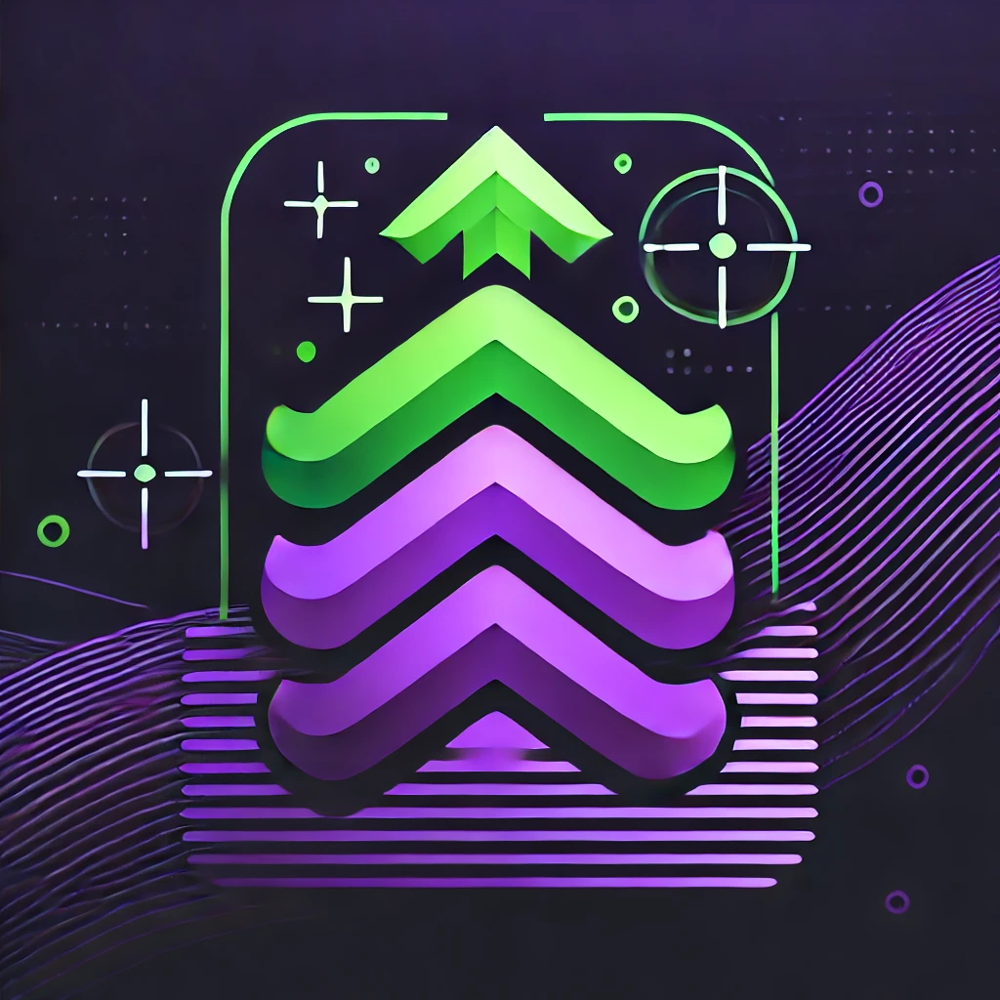

<h1 align="center">
	<br><br>
    Arise - API
</h1>

<p align="center">Missão [ Coragem do Mais Forte ] Iniciada!</p>
<p align="center">O Sistema te dá os Parabéns! <br>Você foi escolhido(a) para ser um(a) <b>Player</b> </p><br>

<p align="center">
Arise é uma Aplicação FullStack construída para fornecer uma experiência gameficada das suas Tarefas/Missões cotidianas, afim de deixar o processo mais divertido e permitir que você alcance os seus objetivos com mais facilidade.</p>
<br>

<p align="center">
Nas linhas abaixo, você terá acesso a versão da API para já começar a se familiarizar com o <b>Sistema</b> .
</p>
  

<p align="center">Com os preparativos prontos, agora: <b>Erga-se!</b> </p><br><br>

<div>
    <p align="center">
    <a href="https://www.linkedin.com/in/yuri-silva99/" target="_blank">
        
    </a>
    <a href="#">
        
    </a>
    <a href="#">
        
    </a>
  <br>
    <a  href="#">
      
    </a>
    <a href="#">
      
    </a>
    <a href="#">
        
    </a>
    </p>
</div>

## Tabela de Conteúdos

<p align="center">
 <a href="#Funcionalidades">Funcionalidades</a> •
 <a href="#Instalação">Instalação</a> • 
 <a href="#Rodando-localmente">Rodando localmente</a> • 
 <a href="#Funcionalidades-futuras">Funcionalidades Futuras</a> • 
 <a href="#Tecnologias">Tecnologias</a> • 
 <a href="#license">Licença</a>
</p>

## 🚀 Funcionalidades

- Gameficação de Tarefas
- Nivelamente de Tarefas/Missões
- Sistema de Níveis
- Personalização de Perfil
- Perfil com Patentes;
- Segurança e Login com Magic Link
- Documentação com Swagger
- E muito mais...

*Para novas Funcionalidades verifique a Seção Funcionalidades Futuras*

## 📕 Instalação

Antes de clonar o projeto, certifique que tenha as seguinte ferramentas instaladas em sua máquina: 

**Ferramentas e Links**
- [Node.js](https://nodejs.org/en/)
- [Npm](https://www.npmjs.com/) or [Yarn](https://yarnpkg.com/)
- [NestJS](https://nestjs.com/)
- [MySQL](https://dev.mysql.com/downloads/)  

**Recomendações**
- Recomendo utilizar o Editor de Texto VSCode para incrementar esse projeto;

## 💻 Rodando localmente

**Passo 1 - Clone o projeto**
 ```bash
git clone https://github.com/Yuri-stack/Arise_Back
```

Navegue até o diretório principal do projeto 
```bash
cd Arise_Back
```

Abra o projeto no VsCode

```bash
code .
```

**Passo 2 - Instale as dependências**

```bash
npm install
```

ou

```bash
yarn
```

*Tenha certeza que sua internet esteja estável, pois esse processo pode levar um tempo*

**Passo 3 - Execute a API**

```bash
npm run dev
```
ou

```bash
yarn dev
```

Após os passos anteriores, abra em seu navegador o projeto acessando a endereço: http://localhost:3000


## 🚧 Funcionalidades Futuras

Veja abaixo as próximas Funcionalidades que serão adicionadas ao projeto:

 - [ ] Sistema de Penalidade;
 - [ ] Controle de Acesso;

## 🌐 Tecnologias

- [NestJS]() - Framework para a construir Aplicações Server-Side eficientes e escaláveis com Node.js;
- [TypeScript](https://www.typescriptlang.org/) - Linguagem de Programação fortemente tipada desenvolvida com base no Javascript;
- [MySQL]() - Bando de Dados Relacional;
- [Prisma]() - ORM voltado para o Ambiente Node;
- [Jest]() - Ferramenta de Desenvolvimento de Testes;

  

## 📝 Licença

<p align="center">
O projeto Arise atualmente está sobre a Licença  <a href="https://choosealicense.com/licenses/mit/">MIT</a> e está aberto para receber implementações de novas funcionalidades de outros devs.  
</p>

<p align="center">
Para constribir, faça um fork do projeto e siga os passos da Seção: Instalação.
</p>

<p align="center">
Feito com 👺 por <a href="https://www.linkedin.com/in/yuri-silva99/">Yuri Oliveira</a>🚀.
</p>
